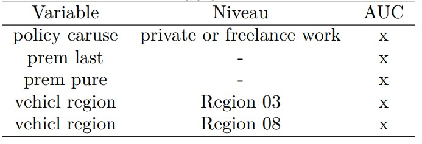

```{r setup, include=FALSE}
knitr::opts_chunk$set(echo = FALSE)
load("../data/trainData.RData")
load("../data/testData.RData")
data <- rbind(trainData, testData)
library(ggplot2)
library(knitr)
library(kableExtra)
library(CASdatasets)
library(xtable)
library(kableExtra)
library(glmnet)
source("../script/_utilityFunction.R")
data(eudirectlapse)
data.init <- eudirectlapse

## Necessaire pour traitement données
data.init[data.init$polholder_diffdriver == "unknown", ]$polholder_diffdriver <- NA
data.init[data.init$vehicl_garage == "unknown", ]$vehicl_garage <- NA
data.init[data.init$policy_caruse == "unknown", ]$policy_caruse <- NA

## Import pour Lasso
load(file="../src/02-lasso/lasso.valid.dev.rds")
load(file="../src/02-lasso/lasso.valid.auc.rds")
```

```{R, FonctionPrintTable, echo = FALSE, include = FALSE, warning = FALSE}
print.tables <- function(dat, caption="", label="", align=rep("c", ncol(dat)+1), digits=3, ...){
  print(xtable(dat, digits = digits,
             caption=caption,
             label=label,
             align=align,),
            include.rownames = FALSE, sanitize.text.function=function(x){x},
            caption.placement = "top", comment=FALSE, type = "html")
}
```

<!-- Introduction

-->

## Plan de la présentation

- Description du problème dans un context actuariel
- Exploration des données utilisées
- Prétraitement des données et exploration non-supevisée
- Description des modèles considérés
- Performance et interprétation des meilleurs modèles
- Conclusion

## Description du problème dans un context actuariel
<!-- 
Dans un context d'assurance, il est important de savoir si un assurer à 
beaucoup de chance de renouveler sont contrat pour l'année suivant. Pourquoi?

- Taux de rétention;
  Savoir combien de personnes vont renouveler permet de faire un estimation
  du taux de rétention. Le taux de rétention est important dans la compagnie 
  pour deux raison. 1. Permet de calculé le taux de croissance. 
  Renouvellement + nouvelles police > 100% indique que la compagnie est
  croissante en terme d'unité. 2. Indicateur de la compétitive dans le marché.
  Si le taux de rétention réelle est plus petit que celui prédit, une raison
  potentielle est que les compétiteurs offrent des meilleurs prix, ou encore
  que le service à la clientèle porte des lacunes.
  
- Élasticité:
  Une autre raison de calculé la probabilité de renouvellement est pour calculé
  l'élastique. Ceci représente la variation dans la probabilité de
  renouvellement pour un variation de prix donnée. Ceci permet de déterminer de
  combien l'augmentation de la prime sera pour chaque contrat. Plus la
  prédiction de renouvellement pour une police donnée est grande, plus
  l'assureur en profitera pour augmenter la prime.
-->
- Taux de rétention:
  $$
    \text{Taux de rétention} = \frac{\text{# Renouvellement}}{\text{# Police
    total}}
  $$
<!--    - Taux de croissance
    - Indicateur de compétitive
-->
- Élasticité:
  $$
    \text{Élasticité} = \frac{\Delta Pr[\text{Renouvellement}]}{\Delta
    \text{Augmentation prix}}
  $$
  

## Descriptions du jeu de données
<!-- 
Notre jeu de données représente le statut de renouvellement pour 23 060 
polices basées sur un an d'observation. 

-->
```{r}
nbRenou <- sum(data$lapse == levels(data$lapse)[1]) / nrow(data)
nbResign <- sum(data$lapse == levels(data$lapse)[2]) / nrow(data)
```

- `r nrow(data)` observations
- 8 variables numériques
- 8 variables catégoriels 
- 2 variables ordonnées
- 1 Variable crée:
  $$
    \text{prem_index} = \frac{\text{prem_final}}{\text{prem_last}}
  $$
- 1 Variable réponse:
    - `r round(nbRenou, 2)*100` % Renouvellement 
    - `r round(nbResign, 2)*100` % Résignation

## Descriptions du jeu de données
```{r}
ggplot(data, aes(x=lapse, y=prem_pure)) + geom_boxplot()
ggplot(data, aes(x=prem_last, y=prem_market , col=lapse)) + geom_point() +
    geom_abline(intercept = 0, slope = 1)


```


## Prétraitement des données

### Traitement des valeurs manquantes

<br/>

- policy_caruse: 3483

- vehicl_garage: 1575

- polholder_diffdriver: 12

- Nombre d'observations touchées: `r nrow(data) - nrow(na.omit(data.init))` (`r round((nrow(data) - nrow(na.omit(data.init))) / nrow(data) *100, 2)`%)

- Les données ne sont pas MCAR

- Imputation multiple


## Prétraitement des données

### Modification de vehicl_powerkw


# Description des modèles

## Modèle de base

- GLM Bernoulli

- Modélisation de la probabilité de résignation avec régression logistique

<font size = "4">
$$\ln \frac{\pi_{res}}{1 - \pi_{res}} = \beta_0 + \sum_{i=1}^p \beta_i x_i$$
</font>
- Estimateurs $\beta_{i}$ 
<font size = "4">
$$    \max\limits_{(\beta_0, \beta_j)} exp\left\{ \sum_{i=1}^n \left( y_{i} (\beta_{0} + \sum_{j=1}^p \beta_{j} x_{j} ) - ln \left(1 + e^{\beta_{0} + \sum\limits_{j=1}^p \beta_{j} x_{j}} \right)\right) \right\}$$
</font>
- TRV 1\% pour la sélection de variable


## Modèle linéaire avec régularisation

- GLM Bernoulli avec régularisation Lasso

- Modélisation de la probabilité de résignation avec régression logistique

- Estimateurs $\beta_{i}$ 

- Optimisation de l'hyperparamètre $\lambda$ 


## Modèle linéaire avec régularisation

### Optimisation de l'hyperparamètre $\lambda$


{width=1000px}

## Modèle linéaire avec régularisation

### Variables avec coeffcient nul de la régulation Lasso

<br/>

{width=800px}

## Modèles k plus proches voisins

<br/>

- Utilisation de la distance euclédienne

- Transformation des variables catégorielles non-ordonnées en variables binaires

- Transformation des variables ordonnées en numérique discrète (1, 2, ...)

- Prédiction de la probabilité de résignation par régression


## Modèles k plus proches voisins

### Optimisation de l'hyperparamètre k

{width=700px}


## Arbre de classification

<ul>
<li> Processus de partitionnement récursif binaire
<li> Deux fonctions de perte testée
$$
\mathcal{L}_G = \sum_{k=1}^K \widehat{P}_{mk} (1 - \widehat{P}_{mk}) \qquad \mathcal{L}_D = - \sum_{k=1}^K \widehat{P}_{mk} \ln( \widehat{P}_{mk})
$$
<br/>
<li> Complexité de l'arbre sera optimisée en fonction de deux paramètres
    <ul>
    <li> paramètre de complexité (cp)
    <li> nombre minimal d'observations dans une feuille (minbucket) </li>
</li>
</ul>

## Arbre de classification 

### Optimisation des hyperparamètres

<br/>

{width=750px}


## Bagging

- Prévision obtenue par l'aggrégation d'arbres de classification

- Chaque arbre utilise l'indice de Gini

- Nombre d'arbre nécessaire

<center>
{width=400px}
</center>


## Forêt aléatoire 

<ul>
<li> Taille de l'échantillon boostrap de 50\%

<li> Nombre d'arbre nécessaire

<center>
{width=400px}
</center>

<li> Deux hyperparamètre à optimiser
    <ul>
    <li> taille minimal d'un noeud (nodesize)
    <li> nombre de prédicteurs choisi aléatoirement (mtry) </li>
</li>
</ul>


## Forêt aléatoire

### Optimisation des hyperparamètres

<br/>

<center>
{width=350px}
</center>


### Boosting de gradient stochastique


