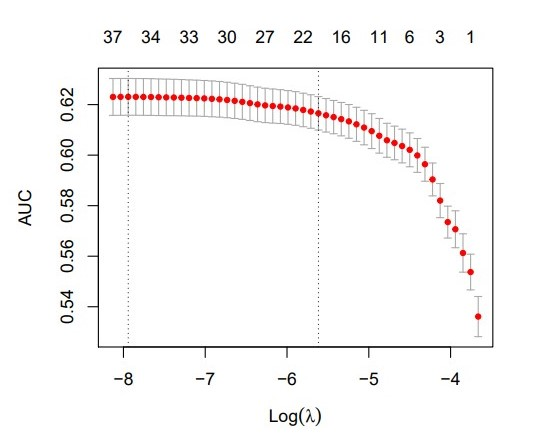

```{r setup, include=FALSE}
knitr::opts_chunk$set(echo = FALSE)
load("../data/trainData.RData")
load("../data/testData.RData")
data <- rbind(trainData, testData)
library(ggplot2)
library(knitr)
library(kableExtra)
library(CASdatasets)
library(xtable)
library(glmnet)
library(scales)
library(gridExtra)
library(gbm)
library(RColorBrewer)
source("../script/_utilityFunction.R")
```

```{r}
data(eudirectlapse)
data.init <- eudirectlapse
## Necessaire pour traitement données
data.init[data.init$polholder_diffdriver == "unknown", ]$polholder_diffdriver <- NA
data.init[data.init$vehicl_garage == "unknown", ]$vehicl_garage <- NA
data.init[data.init$policy_caruse == "unknown", ]$policy_caruse <- NA
## Import pour Lasso
load(file="../src/02-lasso/lasso.valid.dev.rds")
load(file="../src/02-lasso/lasso.valid.auc.rds")

## Import pour gbm 
load(file = "../src/07-gbm/gbm_opti_ROC.rds")
```

```{r, FonctionPrintTable, echo = FALSE, include = FALSE, warning = FALSE}
print.tables <- function(dat, caption="", label="", align=rep("c", ncol(dat)+1), digits=3, ...){
  print(xtable(dat, digits = digits,
             caption=caption,
             label=label,
             align=align,),
            include.rownames = FALSE, sanitize.text.function=function(x){x},
            caption.placement = "top", comment=FALSE, type = "html")
}
```
## Plan de la présentation

- Description du problème dans un context actuariel
- Exploration des données utilisées
- Prétraitement des données et exploration non-supevisée
- Description des modèles considérés
- Performance et interprétation des meilleurs modèles
- Conclusion

## Description du problème dans un context actuariel
- Taux de rétention:
  $$
    \text{Taux de rétention} = \frac{\text{# Renouvellement}}{\text{# Police
    total}}
  $$
- Élasticité:
  $$
    \text{Élasticité} = \frac{\Delta Pr[\text{Renouvellement}]}{\Delta
    \text{Augmentation prix}}
  $$
  

## Descriptions du jeu de données
```{r}
nbRenou <- sum(data$lapse == levels(data$lapse)[1]) / nrow(data)
nbResign <- sum(data$lapse == levels(data$lapse)[2]) / nrow(data)
```

- `r nrow(data)` observations
- 8 variables numériques
- 8 variables catégoriels 
- 2 variables ordonnées
- 1 Variable crée:
  $$
    \text{prem_index} = \frac{\text{prem_final}}{\text{prem_last}}
  $$
- 1 Variable réponse:
    - `r round(nbRenou, 2)*100` % Renouvellement 
    - `r round(nbResign, 2)*100` % Résignation

# Analyse exploratoire
## Variables de primes
### Augmentation au renouvellement
```{r}
ggplot(data, aes(x=policy_age, y=prem_index, col=polholder_BMCevol)) + 
    geom_point(alpha=0.5) + 
    ylab("Augmentation de la prime au renouvellement") + 
    xlab("Âge de la police") + 
    scale_y_continuous(labels = percent) + 
    scale_colour_brewer(name = "Système\nBonus Malus", palette="Dark2") +
    theme_bw()
# ggplot(data, aes(x=lapse, y=prem_index, col=polholder_BMCevol)) + geom_boxplot() +
    # facet_grid(col=vars(polholder_BMCevol)) + 
```

## Variables de primes
### Equart entre la prime chargée et la prime pure
```{r}
ggplot(data, aes(x=lapse, y=prem_final/prem_pure, col=polholder_BMCevol)) + geom_boxplot() +
    ylab("Equart entre la prime chargée et la prime pure") + 
    xlab("") + 
    scale_y_continuous(labels = percent) + 
    scale_colour_brewer(name = "Système\nBonus Malus", palette="Dark2") +
    theme_bw()
```

## Police commercial
```{r, fig.width = 10.8}
gg.veh_age <- 
    ggplot(data, aes(x=lapse, y=vehicl_age, col=policy_caruse)) + geom_boxplot() +
    scale_colour_brewer(name = "Utilitée de\nla voiture", palette="Dark2") +
    xlab("") + 
    ylab("Âge de la voiture") + 
    theme_bw()

gg.pol_age <- 
    ggplot(data, aes(x=lapse, y=polholder_age, col=policy_caruse)) + geom_boxplot() +
    scale_colour_brewer(name = "Utilitée de\nla voiture", palette="Dark2") +
    xlab("") + 
    ylab("Âge de l'assuré") + 
    theme_bw()

grid.arrange(gg.veh_age, gg.pol_age, ncol = 2)
```

## Âge de l'assuré

```{r}
ggplot(data, aes(x=lapse, y=polholder_age, col=prem_freqperyear)) + 
    geom_boxplot() + 
    scale_colour_brewer(name = "Fréquence de paiement", palette="Dark2") + 
    xlab("") +
    ylab("Âge de l'assuré") + 
    theme_bw()
```

## Region géographique

```{r}
regionPourcentageResign <- numeric(14)
for(i in 1:14){
    n <- nrow(data[data$vehicl_region == levels(data$vehicl_region)[i],])
    pourcentage <- sum(data[data$lapse == levels(data$lapse)[2],
                                   ]$vehicl_region ==
                                       levels(data$vehicl_region)[i]) / n
    regionPourcentageResign[i] <- pourcentage
}
tag <- factor(paste0("Region", 1:14), ordered = T, levels=paste0("Region", 1:14))
region <- data.frame(Proportion=regionPourcentageResign, Region=tag)
ggplot(region, aes(x=Region, y=Proportion, fill=TRUE)) + 
    geom_bar(stat="identity", fill="#cccccc", col = "black") +
    geom_hline(yintercept=0.13, linetype="dashed", color="red", size=1.5) + 
    scale_y_continuous(labels = percent) + 
    xlab("Région") + 
    ylab("Proportion de résignation") + 
    theme_bw() + 
    theme(legend.position = "none", axis.text.x = element_text(angle = 45, 
                                                               hjust = 1.1))
```


## Prétraitement des données

### Traitement des valeurs manquantes

<br/>

- policy_caruse: 3483

- vehicl_garage: 1575

- polholder_diffdriver: 12

- Nombre d'observations touchées: `r nrow(data) - nrow(na.omit(data.init))` (`r round((nrow(data) - nrow(na.omit(data.init))) / nrow(data) *100, 2)`%)

- Les données ne sont pas MCAR

- Imputation multiple


## Prétraitement des données

### Modification de vehicl_powerkw


# Description des modèles

## Modèle de base

- GLM Bernoulli

- Modélisation de la probabilité de résignation avec régression logistique

<font size = "4">
$$\ln \frac{\pi_{res}}{1 - \pi_{res}} = \beta_0 + \sum_{i=1}^p \beta_i x_i$$
</font>
- Estimateurs $\beta_{i}$ 
<font size = "4">
$$    \max\limits_{(\beta_0, \beta_j)} exp\left\{ \sum_{i=1}^n \left( y_{i} (\beta_{0} + \sum_{j=1}^p \beta_{j} x_{j} ) - ln \left(1 + e^{\beta_{0} + \sum\limits_{j=1}^p \beta_{j} x_{j}} \right)\right) \right\}$$
</font>
- TRV 1\% pour la sélection de variable


## Modèle linéaire avec régularisation

- GLM Bernoulli avec régularisation Lasso

- Modélisation de la probabilité de résignation avec régression logistique

- Estimateurs $\beta_{i}$ 

- Optimisation de l'hyperparamètre $\lambda$ 


## Modèle linéaire avec régularisation

### Optimisation de l'hyperparamètre $\lambda$


{width=1000px}

## Modèle linéaire avec régularisation

### Variables avec coeffcient nul de la régulation Lasso

<br/>

{width=800px}

## Modèles k plus proches voisins

<br/>

- Utilisation de la distance euclédienne

- Transformation des variables catégorielles non-ordonnées en variables binaires

- Transformation des variables ordonnées en numérique discrète (1, 2, ...)

- Prédiction de la probabilité de résignation par régression


## Modèles k plus proches voisins

### Optimisation de l'hyperparamètre k

{width=700px}


## Arbre de classification

<ul>
<li> Processus de partitionnement récursif binaire
<li> Deux fonctions de perte testée
$$
\mathcal{L}_G = \sum_{k=1}^K \widehat{P}_{mk} (1 - \widehat{P}_{mk}) \qquad \mathcal{L}_D = - \sum_{k=1}^K \widehat{P}_{mk} \ln( \widehat{P}_{mk})
$$
<br/>
<li> Complexité de l'arbre sera optimisée en fonction de deux paramètres
    <ul>
    <li> paramètre de complexité (cp)
    <li> nombre minimal d'observations dans une feuille (minbucket) </li>
</li>
</ul>

## Arbre de classification 

### Optimisation des hyperparamètres

<br/>

{width=750px}


## Bagging

- Prévision obtenue par l'aggrégation d'arbres de classification

- Chaque arbre utilise l'indice de Gini

- Nombre d'arbre nécessaire

<center>
{width=400px}
</center>


## Forêt aléatoire 

<ul>
<li> Taille de l'échantillon boostrap de 50\%

<li> Nombre d'arbre nécessaire

<center>
{width=400px}
</center>

<li> Deux hyperparamètre à optimiser
    <ul>
    <li> taille minimal d'un noeud (nodesize)
    <li> nombre de prédicteurs choisi aléatoirement (mtry) </li>
</li>
</ul>


## Forêt aléatoire

### Optimisation des hyperparamètres

<br/>

<center>
{width=350px}
</center>


## Boosting de gradient stochastique

<li> Amélioration à l'itération t
<font size = "4">
$$
   \sum_{i=1}^n \mathcal{L} \left\{ y_i, \widehat{f}_{t-1}(x_i) + \widehat{f}_{\text{arbre}}^t(x_i) \right\}
$$
</font>
<li> Avec fonction de perte 
<font size = "4">
$$
    \mathcal{L} = \sum_{k=1}^2 \widehat{P}_{ik} \ln( \widehat{P}_{ik})
$$
</font>

<li> Taux d'apprentissage <font size = "5"> $\lambda = 0.005$ </font>, sous-échantillonnage de 75\% 

<li> Deux hyperparamètre à optimiser
    <ul>
    <li> nombre d'arbre (n.trees)
    <li> profondeur maximal des arbres (d) </li>
</li>
</ul>

## Boosting de gradient stochastique

### Optimisation des hyperparamètres

```{r plot_gbm_opti, fig.height=3.5}
plot(gbmfit_Bern)
gbmfit_Bern$bestTune[1:2]
```


